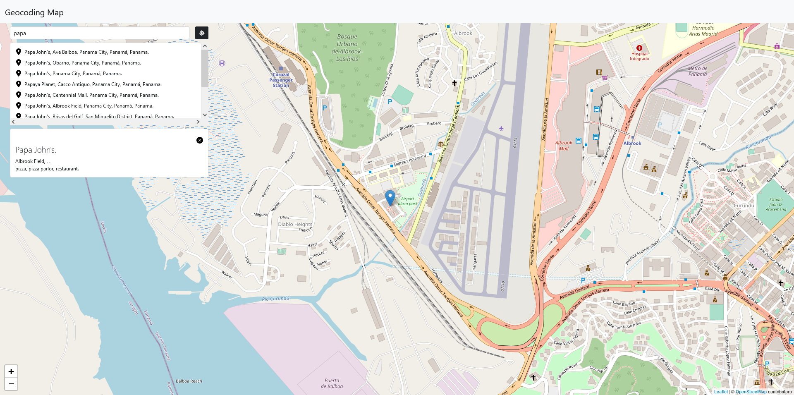
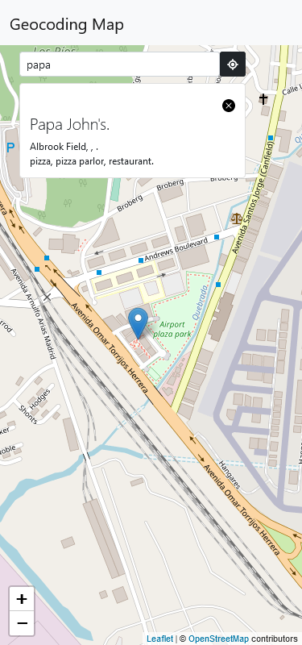

# vue-geocoding

Geocoding web application that allows the user to search for places and displays results on a map (powered by leaflet and Mapbox). The application also allows the user to know their approximate position.

## Table of contents

- [Project setup](#project-setup)
  - [Compiles and hot-reloads for development](#Compiles-and-hot-reloads-for-development)
  - [Compiles and minifies for production](#Compiles-and-minifies-for-production)
  - [Lints and fixes files](#Lints-and-fixes-files)
- [Overview](#overview)
  - [About](#About)
  - [Screenshot](#screenshot)
  - [Live site](#Live-site)
- [How it works](#How-it-works)
  - [Built with](#built-with)
- [Author](#author)

## Project setup
```
npm install
```

### Compiles and hot-reloads for development
```
npm run serve
```

### Compiles and minifies for production
```
npm run build
```

### Lints and fixes files
```
npm run lint
```
## Overview

### About

The application was made in Vue 3 and Bootstrap 5 for the UI, and implements geocoding technology powered by [Mapbox API](https://www.mapbox.com/) and [Leaflet](https://leafletjs.com/).

I highly recommend accept or enable GPS tracking on your browser in order to make application work property.

### Screenshot





### Live site

- Live Site URL: [Live site](https://abdielp.github.io/vue-geocoding/)

## How it works

The app requires to know the user location to work, and get it from Javascript [Geolocation.getCurrentPosition()](https://developer.mozilla.org/en-US/docs/Web/API/Geolocation/getCurrentPosition) method. if app can't get the user position, it will show a pre-defined position in london. 

The user can look for places using the 'search' input/bar, results will be displayed in a card where the user can click them to know that place position on the map.

The user can also know his own position indicaded in the map with a red marker, and remove it or find his position again by pressing a button.

### Built with

- [Leaflet](https://leafletjs.com/)
- [Mapbox API](https://www.mapbox.com/)
- Mobile-first workflow
- CSS custom properties
- [Bootstrap 5](https://getbootstrap.com/)
- [Vue-CLI v3@](https://vuejs.org/) - JS library
- NodeJS Backend
- Express

## Author

- Frontend Mentor - [@AbdielP](https://www.frontendmentor.io/profile/AbdielP)
- GitHub - [@AbdielP](https://github.com/AbdielP)
- Twitter - [@abdiel262](https://twitter.com/Abdiel262)
